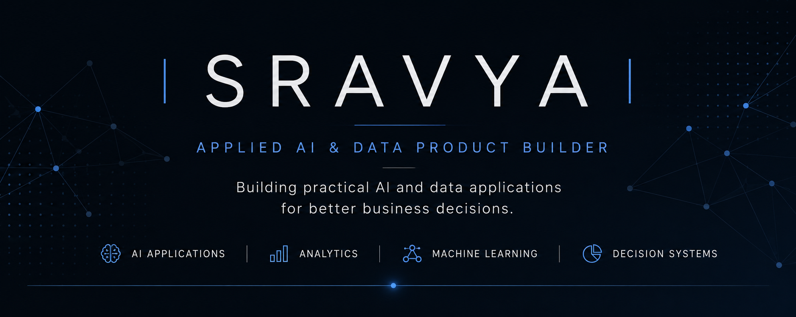

<p align="center">
  
</p>

# Hi, I'm Sravya 👋

### AI & Data Engineer building intelligent systems that transform data into decisions.

I build practical machine learning, analytics, and AI applications that solve business problems through prediction, recommendation, and interactive decision-support tools.

**Target Roles**

`AI Engineer` • `Data Analyst` • `Machine Learning Engineer`


# ⭐ Featured Projects

| Project | Decision Supported |
|---------|--------------------|
| 🎵 Music Recommendation System | Which songs should be recommended to maximize relevance while maintaining diversity? |
| 📊 Analytics Dashboard | Which products, cities and KPIs require business attention? |
| 🤖 Customer Churn Prediction | Which customers are most likely to leave and why? |

---

# 🚀 How I Build

```text
Business Problem
        │
        ▼
Data Collection
        │
        ▼
Cleaning & Feature Engineering
        │
        ▼
Machine Learning / Analytics
        │
        ▼
Interactive Dashboard / App
        │
        ▼
Decision Support
```

---

# 💻 Technical Toolkit

### AI & Machine Learning

Python • Scikit-learn • Pandas • NumPy

Recommendation Systems • Classification

Feature Engineering • Model Evaluation

---

### Data Analytics

SQL

Exploratory Data Analysis

Business Intelligence

KPI Design

Data Visualization

---

### Applications

Streamlit

Git

GitHub

Jupyter

VS Code

---

### Currently Building

Decision-support AI applications

Interactive analytics dashboards

Machine Learning products

---


# 📈 GitHub Activity

<p align="center">


</p>

---

# 🎯 Current Focus

- Building AI-powered decision-support applications
- Improving ML engineering and deployment practices
- Creating recruiter-ready portfolio projects
- Turning business problems into practical AI products

---

<p align="center">

> **AI is not about replacing decisions. It's about helping people make better ones.**

</p>

---

# 📬 Connect

<p align="center">

<a href="https://www.linkedin.com/in/jsrinagasravya">

</a>

<a href="mailto:sravyajaogulamba@gmail.com">

</a>

</p>
